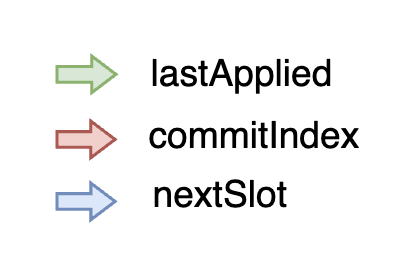
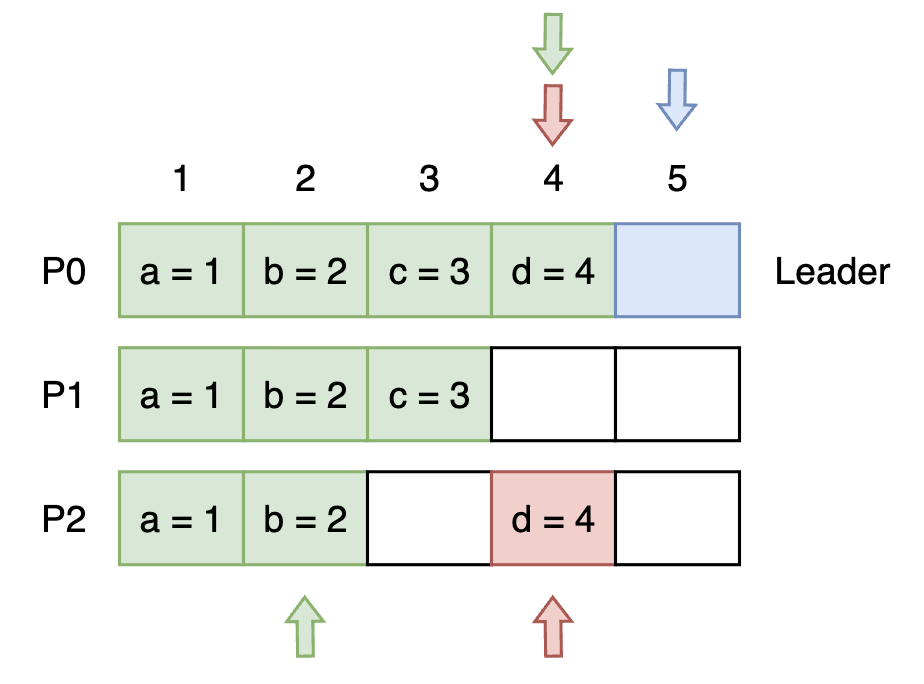

# nomos
a fault-tolerant distributed key-value store implemented using Multi-Paxos and largely inspired by Raft

## Overview
Nomos provides a key-value store replicated across multiple nodes.
Each node acts as a replicated state machine, ensuring that all nodes apply commands in the same total order.

Client commands are replicated using Multi-Paxos:
- Each log slot corresponds to a Paxos consensus instance 
- Once a command is accepted by a quorum, it is applied (committed) 
- Committed commands are applied deterministically to the KV store

Only the leader supports client reads and writes, which simplifies correctness and ensures linearizability.

## High-Level Design
This section gives a quick overview of the system.

All reads and writes go through the Leader node which ensures linearizability. Thus, the system can be divided into two phases: Leader election and client operations.

Once a leader is elected, subsequent client commands bypass the Prepare phase and directly execute Accept rounds, as long as the leader remains non-faulty. For any client operation, leader will send Accept RPC to other nodes.

### Phase 1 - Leader Election
Leader periodically sends heartbeats to all nodes. If a node hasn't heard from the leader in a certain set time, it will start leader election. Multiple nodes may try to run election phase at the same time.

Each node has a local variable `currentBallot` which specifies the ballot with which the node will attempt to become a leader.

When a node receives election message it will accept the highest ballot it has seen so far. When a node accepts a ballot it promises to never accept a command with ballot smaller than the promised ballot. This is stored in `promisedBallot` and also stored on disk.

`leaderBallot` tracks the ballot of the current known leader and is currently equivalent to `promisedBallot`. This may be removed in future revisions.

### Phase 2 - Client Operations
Once a leader is elected it will serve all client read and write operations as long as it stays non-faulty. 
> Important: In Nomos, the leader is guaranteed to have an up-to-date log. Due to this, for read operations, it can directly return result from its local KV store.

For each client write, a slot is chosen for that command. This is decided by leader and is accepted by majority nodes. Once a quorum of accepts is received, leader commits the command (i.e. applies to the state machine). This commit information is propagated to other nodes via a Commit RPC, allowing followers to advance their `commitIndex`.

Replicated log has the following variables:\
`lastApplied` - this specifies the latest slot that was applied locally, a slot can be only applied if all slots <= current slot have been applied\
`commitIndex` - this specifies the slot upto which a node can safely apply (i.e. upto which slot a quorum of accepts have been received and are ready to be committed), this is logged to disk\
`nextSlot` - this specifies the slot for next client command. Although it's stored on each node, it is meaningless on non-leader nodes. Only the leader uses this for client operations.



The following is an example system state of nomos. For this example, we have a cluster consisting of 3 nodes where quorum is 2 nodes. 



- P0 is the leader node; Leader always has the latest log
- Other nodes (P1 and P2) can be lagging behind (as shown in the example, each of them is missing a log entry; P1 is missing log at index 4 and P2 is missing log at index 3)
- Green slots represents log entries (or commands) that have been applied (or committed)
- Red slot represents the slot upto which a client can safely apply log entries but iff all log entries before it have been applied; in the example, even though P2 has log entry for index 4, it can not apply it yet since it's missing entry 3 (it has however still accepted the value at index 4)
- Blue slot represents the next slot at which the leader will insert a new client command

### Failure Recovery

What happens when the leader fails?\
A new node will try to become the leader. In the above example, lets say P0 fails and P1 detects it first and starts leader election. It will receive a vote from P2 and from itself. This will promote it to leader since it has received a quorum votes.


How does the new leader construct upto date log?\
Whenever a node "accepts" a Prepare message (leader election message), it returns its own log entries along with the promise. The new "wannabe" leader will then check if it's missing any log entry. If it is missing a log entry or if an entry it has is outdated (old ballot) it will merge its own local log with the log entries it receives from other nodes.\
Since we ensure a command is only applied if quorum nodes respond with OK, the new leader will intersect with at least one node that contains the missing log entries. This helps in reconstructing upto date log.\
The nodes also log (to disk) the `commitIndex`. For all the log entries <= `commitIndex` the new leader will safely apply them locally and does not need to communicate this to other nodes.\
For newly recovered log entries beyond the `commitIndex`, the new leader will try to get them "Accept"-ed by a majority of nodes. If accepted, they're also applied.
> Important: When the leader is recovering, it does not accept any client commands. This helps it safely recover and reconcile its log.


## System Properties
1. Leader Election
- **Safety**: At most one leader is active at any given time
- **Liveness**: Some node is eventually elected leader

Leader election is driven by ballot-based Prepare rounds and randomized election timeouts to avoid split votes.
2. Command Replication
- **Safety**: No two nodes ever apply different commands for the same log slot
- **Liveness**: Logs at all nodes eventually converge

## Node State and key variables
Each node maintains the following important state:
- `log`: Map of log slot - accepted entry (ballot, value)
- `commitIndex`: Highest log slot known to be committed 
- `lastApplied`: Highest log slot applied to the local KV store 
- `nextSlot`: Next log slot the leader will propose
- `currentBallot`: Ballot used when attempting to become leader 
- `promisedBallot`: Highest ballot this node has promised not to violate 
- `leaderBallot`: Ballot of the current known leader

Commands are only applied when:
- they are present in the log 
- their slot index ≤ commitIndex 
- all prior slots have been applied

## Fault Tolerance Guarantees

Nomos tolerates:
- Up to ⌊(N−1)/2⌋ node crashes 
- Leader failure during replication 
- Lagging or temporarily unavailable replicas

Safety is preserved as long as a majority of nodes are available.

## Running Nomos

Start multiple nodes on different ports:

```bash
go run client/main.go --id=1 --port=8001
go run client/main.go --id=2 --port=8002
go run client/main.go --id=3 --port=8003
```

#### Peer Configuration (important)

Peers are currently hard-coded in client/main.go.

To change cluster membership, you must either:
- edit the peer address map in main.go, or 
- extend the code to accept peer addresses via command-line flags

Dynamic membership is not currently supported.

## Interactive Commands

Each node runs an interactive REPL with the following commands:

`prepare` Manually triggers a leader election (Prepare phase) (was mainly used for initial testing)\
`put <key> <value>` Submits a write request to the leader\
`get <key>` Reads a value from the leader (followers reject)\
`status` Prints the node’s internal state (ballots, indices, role)\
`kv` Prints the current key-value store contents\
`log` Prints the current local log\
`ping <addr>` Sends a ping RPC to another node (for connectivity testing)\
`exit` Shuts down the node

## Limitations & Future Work

- Client operations are not supported during failure recovery
- Membership and configuration is hardcoded, can not be configured at runtime
- No log compaction or snapshotting (WAL grows unbounded)
- No explicit follower catch-up RPCs beyond Paxos recovery, nodes can indefinitely lag (until a node becomes the leader and reconciles its log)
- Reads and writes use leader-only semantics
- No lease based leader, failure detectors as we know can not be 100% accurate
- Cannot ensure exactly-once semantics

Future improvements include following (in no particular order): 

- use request ID for each client command to ensure exactly-once semantics
- log compaction
- periodic recovery of lagging nodes
- batched logging
- allow configuration changes (configuration will sit in the same log table)

## References

1. https://lamport.azurewebsites.net/pubs/paxos-simple.pdf
2. [John Ousterhout's lecture on Paxos (and Multi-Paxos)](https://www.youtube.com/watch?v=JEpsBg0AO6o)
3. [John Ousterhout's talk on Raft](https://www.youtube.com/watch?v=vYp4LYbnnW8)
4. https://raft.github.io/raft.pdf
